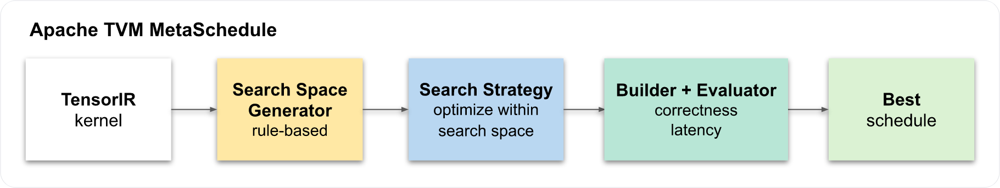
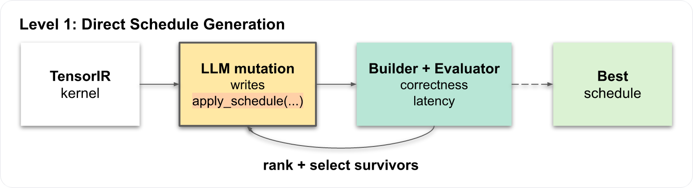
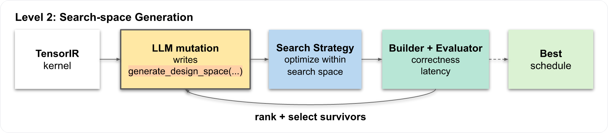
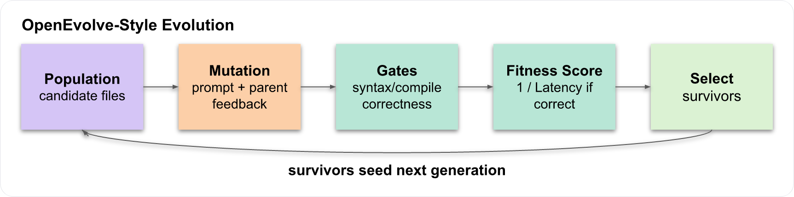

# Structured Evolution for Search-Space Generation in ML Kernel Scheduling

Kevin Chan (tsekchan@stanford.edu), Newton Chen (hsinchen@stanford.edu)

> **[Paper](docs/structured_evolve_final_report.pdf) | [Slides](https://docs.google.com/presentation/d/1vvpNpNT26Vv0HoV24mL1kYK0mQ2Kmj2Afpo3H-9JjEk/edit?usp=sharing) | [Code](https://github.com/t-sekai/structured-evolve)**

## Abstract

This project studies where a zero-shot large language model should intervene in
an ML kernel scheduling pipeline, and whether its flexibility can outperform a
rule-based autotuning baseline, Apache TVM MetaSchedule. Rather than asking an
LLM only to emit one concrete low-level schedule, we compare that direct
approach with a structured alternative in which the LLM generates a
MetaSchedule design space and TVM searches within it.

The implementation evaluates fixed TensorIR workloads with automatic syntax,
compile, correctness, latency, and search-time gates inside an OpenEvolve-style
mutation-and-selection loop. The final results do not support the hypothesis
that LLM-generated search spaces consistently outperform direct schedule
generation or standard MetaSchedule. MetaSchedule remains strongest on regular
matrix multiplication; direct schedule evolution is less reliable but can find
large speedups on irregular CUDA shapes where MetaSchedule fails in our local
TVM build; generated search-space evolution is more conservative and sensitive
to prompt, seed, and feedback quality.

## Visual Overview

The main comparisons track latency, speedup, and validity rate across the
baseline and evolved scheduling pipelines.









## Research Snapshot

| Question | Implementation |
| --- | --- |
| Can LLMs directly write useful TVM schedules? | Level 1 candidates define `apply_schedule(...)` and are compiled, checked, timed, and selected by fitness. |
| Can LLMs generate better search spaces for TVM? | Level 2 candidates define `generate_design_space(...)`; MetaSchedule tunes inside the generated space. |
| How are failures controlled? | Syntax checks, compile checks, correctness checks, benchmark gates, compact evaluator feedback, survivor summaries, and optional rejection cascades. |
| What workloads are supported? | TensorIR matmul and NCHW Conv2D on `llvm` and `cuda` targets. |
| What is tracked in this repo? | Source code, seed candidates, milestone docs, final report, and checkpoint result snapshots. Fresh `results/` output is ignored. |

**Key final-report takeaways:**

- MetaSchedule is still the best baseline on regular matmul cases where it
  successfully initializes and tunes.
- Level 1 direct schedule evolution can discover fast CUDA schedules for
  irregular matmul shapes, but it has a higher invalid-candidate rate.
- Level 2 search-space evolution is attractive structurally, but the measured
  results are prompt-, seed-, and feedback-sensitive.
- The strongest promise is coverage expansion for irregular or underspecified
  workloads, not replacing mature autotuners on their easiest cases.

## Milestone Documents

| Stage | Link |
| --- | --- |
| Proposal | [docs/structured_evolve_project_proposal.pdf](docs/structured_evolve_project_proposal.pdf) |
| Checkpoint 1 | [docs/checkpoint_1.md](docs/checkpoint_1.md) |
| Checkpoint 2 | [docs/checkpoint_2.md](docs/checkpoint_2.md) |
| Final Report | [docs/structured_evolve_final_report.pdf](docs/structured_evolve_final_report.pdf) |

## Repository Layout

```text
scripts/
  run_experiment.py        # one method on one workload instance
  run_benchmark_suite.py   # method x shape x target benchmark matrix
  analyze_results.py       # CSV summaries and SVG figures

src/
  kernels/                 # TensorIR matmul and NCHW Conv2D workloads
  strategies/              # fixed, MetaSchedule, generated schedule/search-space
  eval/                    # build, correctness, timing, result persistence
  evolution/               # prompts, selection, fitness, Bedrock, cascade checks

generated/
  schedules/               # tracked Level 1 seed/direct schedule candidates
  search_spaces/           # tracked Level 2 seed/search-space candidates

docs/                      # proposal and checkpoint notes
results_ckpt1/, results_ckpt2/
                           # tracked checkpoint result snapshots
```

## Install

TVM is expected to come from a local source build. First follow the TVM source
install guide:

[TVM Source Install Guide](https://tvm.apache.org/docs/install/from_source.html#install-from-source)

Then activate the Python environment that can import your built TVM and install
the project dependencies:

```bash
python -c "import tvm; print(tvm.__version__)"
pip install -r requirements.txt
```

For LLM-backed evolution, copy the example config and fill in local AWS Bedrock
credentials. The real config is ignored by git.

```bash
cp config/api_keys.example.toml config/api_keys.toml
```

## Experiment Methods

| Method | Level | What it does |
| --- | --- | --- |
| `fixed` | baseline | Applies the workload's hand-written fixed schedule. |
| `metaschedule` | baseline | Tunes the canonical TensorIR module with TVM MetaSchedule. |
| `level1-candidate` | Level 1 | Benchmarks one existing generated direct schedule file. |
| `level2-candidate` | Level 2 | Benchmarks one existing generated search-space file after MetaSchedule tuning. |
| `level1-search` | Level 1 | Evolves direct schedule candidates, then benchmarks the best candidate. |
| `level2-search` | Level 2 | Evolves generated search spaces, then evaluates the winning search-space candidate. |

Candidate interfaces:

```python
# Level 1 direct schedule candidate
def apply_schedule(ir_module: tvm.IRModule, target_name: str) -> tvm.IRModule:
    ...
```

```python
# Level 2 search-space candidate
def generate_design_space(sch: tvm.s_tir.Schedule):
    ...
```

Target-specific defaults are wired into `src/eval/method.py`:

| Workload | Target | Level 1 default | Level 2 default |
| --- | --- | --- | --- |
| `matmul` | `llvm` | `generated/schedules/identity.py` | `generated/search_spaces/basic_matmul.py` |
| `matmul` | `cuda` | `generated/schedules/cuda_matmul.py` | `generated/search_spaces/cuda_matmul.py` |
| `conv2d` | `llvm` | `generated/schedules/identity.py` | `generated/search_spaces/basic_conv2d.py` |
| `conv2d` | `cuda` | `generated/schedules/cuda_conv2d.py` | `generated/search_spaces/cuda_conv2d.py` |

The `*_ambitious.py` files under `generated/` are tracked seed/candidate
variants for report experiments and manual comparisons.

## Baseline Runs

Run the fixed CUDA matmul baseline:

```bash
python scripts/run_experiment.py \
  --method fixed \
  --workload matmul \
  --target cuda \
  --M 8 --N 256 --K 1024
```

Run the CUDA MetaSchedule matmul baseline:

```bash
python scripts/run_experiment.py \
  --method metaschedule \
  --workload matmul \
  --target cuda \
  --M 8 --N 256 --K 1024 \
  --max-trials-global 1024 \
  --num-trials-per-iter 64 \
  --cost-model xgb \
  --task-scheduler gradient
```

These commands write local output under ignored `results/` unless
`--output-dir` is changed.

## Evolution Runs

Run Level 1 direct schedule evolution on CUDA matmul with Bedrock:

```bash
python scripts/run_experiment.py \
  --method level1-search \
  --use-bedrock \
  --workload matmul \
  --target cuda \
  --M 8 --N 256 --K 1024 \
  --generations 10 \
  --population-size 8 \
  --survivors 3
```

Run Level 2 search-space evolution on CUDA matmul with Bedrock:

```bash
python scripts/run_experiment.py \
  --method level2-search \
  --use-bedrock \
  --workload matmul \
  --target cuda \
  --M 8 --N 256 --K 1024 \
  --generations 10 \
  --population-size 8 \
  --survivors 3 \
  --search-max-trials-global 128 \
  --search-num-trials-per-iter 32 \
  --max-trials-global 1024 \
  --num-trials-per-iter 64 \
  --cost-model xgb \
  --task-scheduler gradient
```

Change `--workload` and the shape arguments to run Conv2D, change `--target`
to `llvm` for CPU, or omit `--use-bedrock` for deterministic dry-run mutation.

Useful evolution controls:

| Flag | Purpose |
| --- | --- |
| `--disable-evaluator-feedback` | Ablate compact feedback from parent evaluation. |
| `--disable-rejection-cascade` | Skip cheap syntax/compile/correctness rejection before full evaluation. |
| `--enable-elite-carry-forward` | Carry elite survivors directly into the next generation. |
| `--disable-diverse-inspiration` | Do not mutate an extra valid non-elite candidate as a diversity source. |
| `--prompt-style creative` | Use broader mutation prompts for more exploratory variants. |
| `--level2-final-evaluation-policy fresh-retune` | Retune the winning Level 2 search-space generator for final evaluation. This is the default. |
| `--level2-final-evaluation-policy exact-winner` | Benchmark the exact scheduled module selected during search. |

## Benchmark Suites

Run the four-way comparison across matmul shapes:

```bash
python scripts/run_benchmark_suite.py \
  --shape 256,256,256 \
  --shape 8,256,1024 \
  --shape 17,1031,2917 \
  --target cuda \
  --methods fixed,metaschedule,level1-search,level2-search \
  --use-bedrock
```

Run the same comparison on Conv2D:

```bash
python scripts/run_benchmark_suite.py \
  --workload conv2d \
  --conv2d-shape 1,3,16,16,8,3,3,1,1 \
  --conv2d-shape 1,8,32,32,16,3,3,1,1 \
  --target cuda \
  --methods fixed,metaschedule,level1-search,level2-search \
  --use-bedrock
```

Search methods append both search-time candidate evaluations and final
benchmark rows to the shared results CSV. Use `benchmark_group` to separate
those rows during analysis.

## Analysis

Experiment runs append JSON files and a shared `results.csv` under the selected
output directory. The default output directory is `results/`, which is ignored
by git.

Create analysis tables and SVG figures:

```bash
python scripts/analyze_results.py --results-csv results/results.csv
```

Analyze a tracked checkpoint snapshot:

```bash
python scripts/analyze_results.py \
  --results-csv results_ckpt2/results.csv \
  --output-dir results/analysis/from_ckpt2
```

Analysis outputs include:

| File | Contents |
| --- | --- |
| `summary_by_strategy.csv` | Compile rate, correctness rate, latency, tuning time, and evolution time grouped by method. |
| `speedups.csv` | Speedups against a configurable baseline strategy. |
| `evolution_best_by_generation.csv` | Best fitness, latency, and candidate counts by generation. |
| `figures/*.svg` | Latency and evolution-fitness plots. |

## Metrics

Each run records:

- `compile_passed`
- `correctness_passed`
- `max_abs_error`
- `mean_abs_error`
- `latency_ms_mean`
- `latency_ms_std`
- `tuning_time_sec`
- `evolution_time_sec`
- `num_candidates_evaluated`
- `best_candidate_path`
- `experiment_id`
- `run_id`
- `experiment_method`
- `generation`
- `candidate_id`
- `fitness_score`
- `selection_role`
- `benchmark_group`

`benchmark_group` separates final benchmark rows from search-time candidate
evaluations, which matters when aggregating search runs.

## Final Report Defaults

These were the default settings used for the final report runs:

| Setting | Value |
| --- | --- |
| `--workload` | `matmul` |
| `--shape` | `256,256,256` / `8,256,1024` / `17,1031,2917` |
| `--target` | `cuda` |
| `--generations` | `10` |
| `--population-size` | `8` |
| `--survivors` | `3` |
| `--enable-elite-carry-forward` | enabled |
| `--disable-diverse-inspiration` | not set; extra valid non-elite mutation source enabled |
| `--disable-rejection-cascade` | not set; rejection cascade enabled |
| `--disable-evaluator-feedback` | not set; evaluator feedback enabled |
| `--search-max-trials-global` | `128` |
| `--search-num-trials-per-iter` | `32` |
| `--max-trials-global` | `1024` |
| `--num-trials-per-iter` | `64` |
| `--cost-model` | `xgb` |
| `--task-scheduler` | `gradient` |
| Bedrock model | `gpt-oss-120b` |

## Citation

If you use this paper or repository, please cite:

```bibtex
@misc{chan2026structuredevolve,
  title = {Structured Evolution for Search-Space Generation in ML Kernel Scheduling},
  author = {Chan, Kevin and Chen, Newton},
  year = {2026},
  url = {https://github.com/t-sekai/structured-evolve},
  note = {Paper and code repository}
}
```
